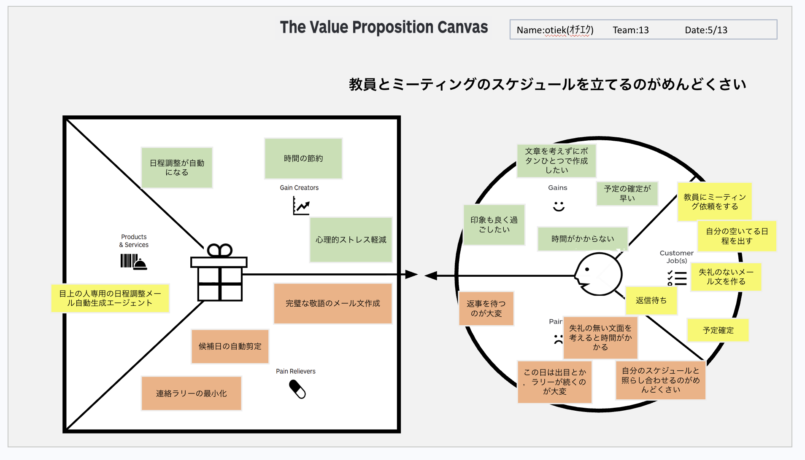

# Value Proposition Canvas v1

## Customer Segment (顧客像)

### Customer Job(s) (顧客のジョブ)
- 教員にミーティング依頼をする
- 自分の空いてる日程を出す
- 失礼のないメール文を作る
- 予定確定

### Pains (ペイン: 悩み・苦痛)
- 返事を待つのが大変
- 失礼の無い文面を考えると時間がかかる
- この日は駄目とか、ラリーが続くのが大変
- 自分のスケジュールと照らし合わせるのがめんどくさい

### Gains (ゲイン: 期待する利益・恩恵)
- 文章を考えずにボタンひとつで作成したい
- 予定の確定が早い
- 印象も良く過ごしたい
- 時間がかからない

---

## Value Proposition (提供価値)

### Products & Services (製品・サービス)
- 目上の人専用の日程調整メール自動生成エージェント

### Pain Relievers (ペインリリーバー: 苦痛の軽減)
- 完璧な敬語のメール文作成
- 候補日の自動剪定
- 連絡ラリーの最小化

### Gain Creators (ゲインクリエイター: 利益の創出)
- 日程調整が自動になる
- 時間の節約
- 心理的ストレス軽減
